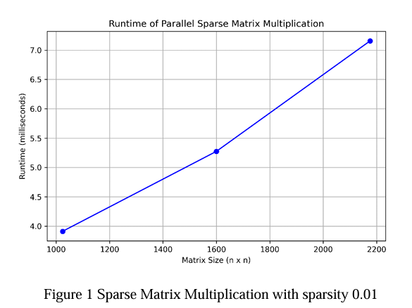
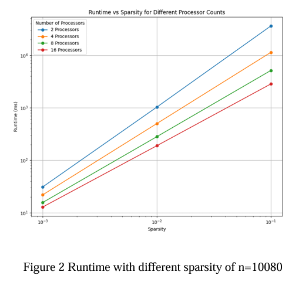
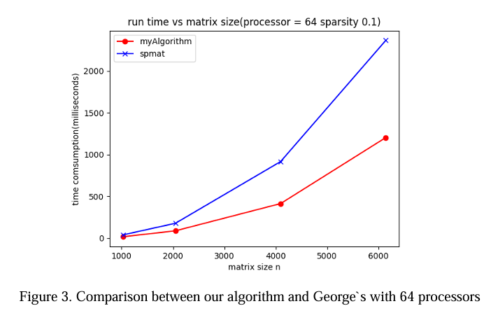
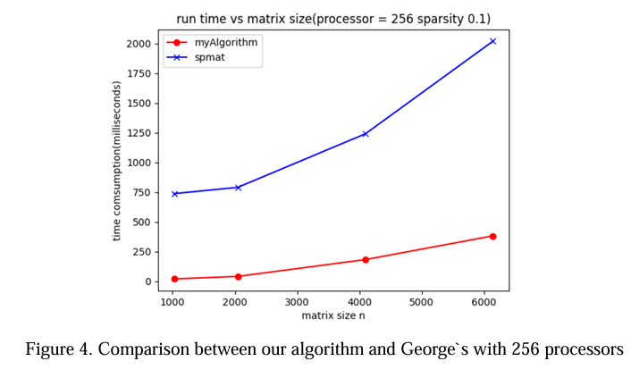

# spmat Sparse Matrix Multiplication
### How to run
```Algorithm(spat/myAlgorithm) \<n\> \<sparsity\> \<outputFlag\> \<outputFile\>```
<outputFlag>
- 1: write in a file
- 0: no writing out

### Performance
1. Time consumption increases linearly with matrix size n in ```Figure 1``` 
2. Time consumption increases linearly with the sparsity of the matrix, decreases with the increasing of processors,as shown in ```Figure 2```
3. 2D partition and hashmap fast identifying matching elements further improves the performance, especially in a large number of processors, as shown in ```Figure 3``` and ```Figure 4```
   




